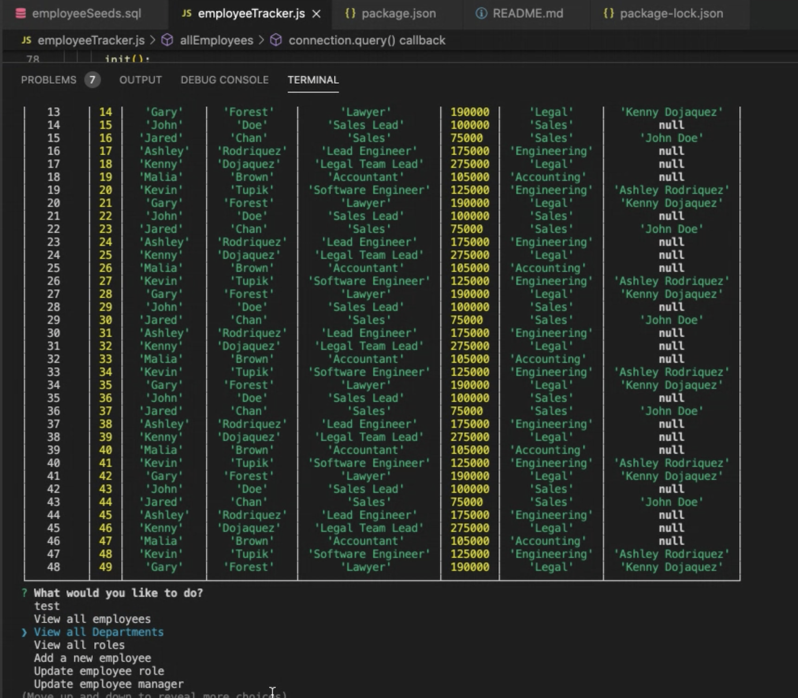
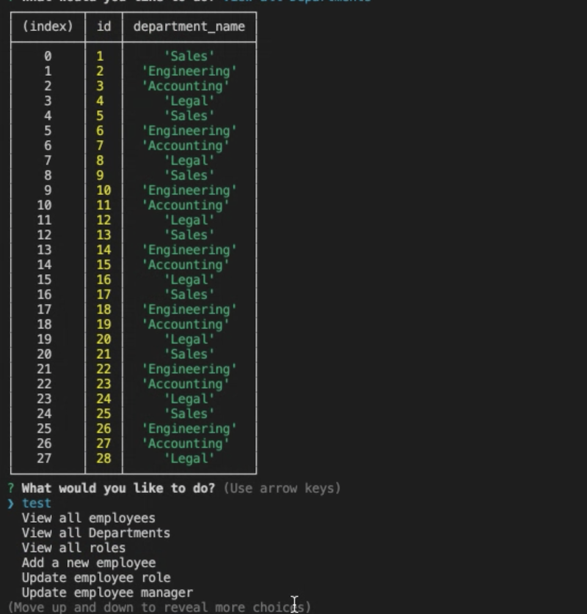

# Employee-Tracker

This is an Employee tracker app demonstrating how non-developers can view and interact with information stored on a databases. Often these interfaces are known as Content Management Systems. the app has been built for managing a company's employees using node, inquirer, and MySQL. 

## Steps
A database schema was built containing three tables: Department, Role and Employees.

After building a command-line application, the user is able to:

  * Add departments, roles, employees

  * View departments, roles, employees

  * Update employee roles

# User Story
```
As a business owner
I want to be able to view and manage the departments, roles, and employees in my company
So that I can organize and plan my business
```

## Screenshots





## Installation

 Use the [MySQL](https://www.npmjs.com/package/mysql) NPM package to connect to your MySQL database and perform queries.

 Use [InquirerJs](https://www.npmjs.com/package/inquirer/v/0.2.3) NPM package to interact with the user via the command-line.

 Use [console.table](https://www.npmjs.com/package/console.table) to print MySQL rows to the console. There is a built-in version of `console.table`, but the NPM package formats the data a little better for our purposes.

# Links

 [Github page](https://github.com/Valkimani/Employee-Tracker)
<<<<<<< HEAD
[Screencastify](https://drive.google.com/file/d/1Ppor6jehJM1rmUgpocpnVgqUyRqYWbZP/view)
=======


 [Video demo](https://drive.google.com/file/d/1Ppor6jehJM1rmUgpocpnVgqUyRqYWbZP/view)

# License 

MIT License
Copyright (c) [2020] [Valentine Kimani]
Permission is hereby granted, free of charge, to any person obtaining a copy of this software and associated documentation files (the "Software"), to deal in the Software without restriction, including without limitation the rights to use, copy, modify, merge, publish, distribute, sublicense, and/or sell copies of the Software, and to permit persons to whom the Software is furnished to do so, subject to the following conditions:
The above copyright notice and this permission notice shall be included in all copies or substantial portions of the Software.
THE SOFTWARE IS PROVIDED "AS IS", WITHOUT WARRANTY OF ANY KIND, EXPRESS OR IMPLIED, INCLUDING BUT NOT LIMITED TO THE WARRANTIES OF MERCHANTABILITY, FITNESS FOR A PARTICULAR PURPOSE AND NONINFRINGEMENT. IN NO EVENT SHALL THE AUTHORS OR COPYRIGHT HOLDERS BE LIABLE FOR ANY CLAIM, DAMAGES OR OTHER LIABILITY, WHETHER IN AN ACTION OF CONTRACT, TORT OR OTHERWISE, ARISING FROM, OUT OF OR IN CONNECTION WITH THE SOFTWARE OR THE USE OR OTHER DEALINGS IN THE SOFTWARE.
```

# Credits
- - © 2019 Trilogy Education Services, a 2U, Inc. brand. All Rights Reserved.
>>>>>>> 3b56b9724e47b582b1d04c764fa797b63d5612a2
